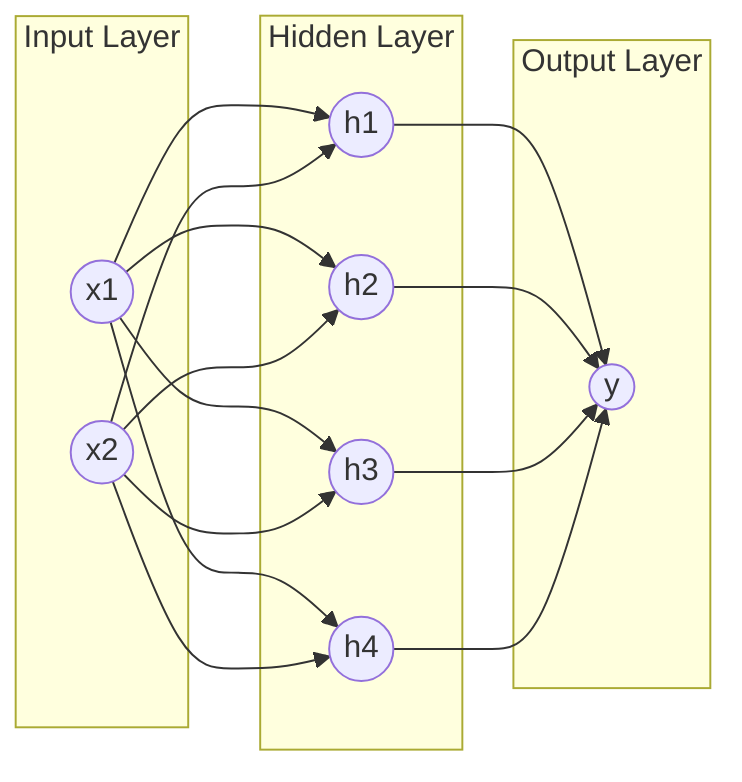

# Chapter 4: Neural Network Primitives

In this chapter, we will explore the building blocks of neural networks. We'll start with the theory, visualize how they work, and then implement a simple neural network from scratch using `xla-rs` to solve the XOR problem.

## What is a Neural Network?

A neural network is a computational model inspired by the human brain. It consists of layers of interconnected nodes (neurons) that process information.

### Visualizing the Graph

We can visualize a neural network as a directed graph where:
- **Nodes** represent neurons (holding values).
- **Edges** represent weights (connections between neurons).

A simple 2-layer network looks like this:



Mathematically, each layer performs a linear transformation followed by a non-linear activation function:

$$ y = f(xA^T + b) $$

Where:
- $x$ is the input vector.
- $A$ is the weight matrix.
- $b$ is the bias vector.
- $f$ is the activation function (e.g., Sigmoid, ReLU).

## The Linear Layer

The most fundamental layer is the `Linear` (or Fully Connected) layer. It performs the affine transformation $y = xA^T + b$.

In `xla-rs`, we define a `Linear` layer that holds `Variable`s for weights and biases. Using `Variable`s allows us to automatically compute gradients during training.

```rust
# extern crate xla_rs;
# use xla_rs::autograd::Variable;
# use xla_rs::tensor::{Tensor, Cpu};
struct Linear {
    weight: Variable<f32, 2>,
    bias: Variable<f32, 2>, // Shape [1, out] for broadcasting
}

impl Linear {
    fn new(in_features: usize, out_features: usize) -> Self {
        // Initialize weights with random values (pseudo-random here for example)
        let w_data = (0..in_features * out_features)
            .map(|i| ((i as f32 * 0.1).sin() * 0.5)) 
            .collect();
        let weight = Variable::new(Tensor::new(w_data, [in_features, out_features]).unwrap());

        let b_data = vec![0.0; out_features];
        let bias = Variable::new(Tensor::new(b_data, [1, out_features]).unwrap());

        Self { weight, bias }
    }

    fn forward(&self, x: &Variable<f32, 2>) -> Variable<f32, 2> {
        // y = x @ W + b
        let xw = x.matmul(&self.weight).unwrap();
        xw + self.bias.clone()
    }
}
```

## Activation Functions

To solve non-linear problems (like XOR), we need non-linear activation functions. A common choice is the Sigmoid function:

$$ \sigma(x) = \frac{1}{1 + e^{-x}} $$

We can implement this as a custom `GraphNode` in `xla-rs` to support automatic differentiation.

```rust,ignore
# extern crate xla_rs;
# use std::cell::RefCell;
# use std::rc::Rc;
# use xla_rs::autograd::{GraphNode, Variable};
# use xla_rs::tensor::{Cpu, Tensor, TensorElem};
# use num_traits::Float;
// ... SigmoidNode implementation details (omitted for brevity, see full example below) ...
```

## Training a Neural Network

Training involves four steps:
1.  **Forward Pass**: Compute predictions.
2.  **Loss Calculation**: Measure the error (e.g., Mean Squared Error).
3.  **Backward Pass**: Compute gradients using `autograd`.
4.  **Parameter Update**: Adjust weights to minimize error.

### The XOR Problem

The XOR function is a classic problem that requires a non-linear model.

| Input | Target |
|-------|--------|
| 0, 0  | 0      |
| 0, 1  | 1      |
| 1, 0  | 1      |
| 1, 1  | 0      |

Let's build a network with one hidden layer to solve it.

### Complete Example

Here is the complete code to train a neural network on the XOR problem.

```rust,no_run
extern crate xla_rs;
extern crate num_traits;
use std::cell::RefCell;
use std::rc::Rc;
use xla_rs::autograd::{GraphNode, Variable};
use xla_rs::tensor::{Cpu, Tensor, TensorElem};

// --- Sigmoid Implementation ---
#[derive(Debug)]
struct SigmoidNode<T: TensorElem, const RANK: usize> {
    input: Tensor<T, RANK, Cpu>,
    output: Tensor<T, RANK, Cpu>,
    input_grad: Rc<RefCell<Option<Tensor<T, RANK, Cpu>>>>,
    out_grad: Rc<RefCell<Option<Tensor<T, RANK, Cpu>>>>,
    parents: Vec<Rc<dyn GraphNode>>,
}

impl<T: TensorElem + num_traits::Float, const RANK: usize> GraphNode for SigmoidNode<T, RANK> {
    fn backward(&self) {
        if let Some(grad) = self.out_grad.borrow().as_ref() {
            let one = T::one();
            let y = &self.output;
            let derivative = y.map(|val| val * (one - val));
            let dx = (grad * &derivative).unwrap();

            let mut input_grad = self.input_grad.borrow_mut();
            if let Some(g) = input_grad.as_mut() {
                *g = (g as &Tensor<T, RANK, Cpu> + &dx).unwrap();
            } else {
                *input_grad = Some(dx);
            }
        }
    }

    fn parents(&self) -> Vec<Rc<dyn GraphNode>> {
        self.parents.clone()
    }
}

fn sigmoid<const RANK: usize>(x: &Variable<f32, RANK>) -> Variable<f32, RANK> {
    let data = x.data.map(|v| 1.0 / (1.0 + (-v).exp()));
    let mut parents = Vec::new();
    if let Some(p) = &x.node { parents.push(p.clone()); }
    let out_grad = Rc::new(RefCell::new(None));
    let node = Rc::new(SigmoidNode {
        input: x.data.clone(),
        output: data.clone(),
        input_grad: x.grad.clone(),
        out_grad: out_grad.clone(),
        parents,
    });
    Variable { data, grad: out_grad, node: Some(node) }
}

// --- Linear Layer ---
struct Linear {
    weight: Variable<f32, 2>,
    bias: Variable<f32, 2>,
}

impl Linear {
    fn new(in_features: usize, out_features: usize) -> Self {
        let w_data = (0..in_features * out_features)
            .map(|i| {
                let s = (i + 1) as f32;
                ((s * 12.9898).sin() * 43758.5453).fract() - 0.5
            }) 
            .collect();
        let weight = Variable::new(Tensor::new(w_data, [in_features, out_features]).unwrap());
        let b_data = vec![0.0; out_features];
        let bias = Variable::new(Tensor::new(b_data, [1, out_features]).unwrap());
        Self { weight, bias }
    }

    fn forward(&self, x: &Variable<f32, 2>) -> Variable<f32, 2> {
        let xw = x.matmul(&self.weight).unwrap();
        xw + self.bias.clone()
    }
}

fn update_param<const RANK: usize>(var: &mut Variable<f32, RANK>, lr: f32) {
    let data = var.data.data_mut();
    if let Some(grad) = var.grad.borrow().as_ref() {
        let grad_data = grad.data();
        for (w, g) in data.iter_mut().zip(grad_data.iter()) {
            *w -= lr * g;
        }
    }
}

fn zero_grad<const RANK: usize>(var: &Variable<f32, RANK>) {
    *var.grad.borrow_mut() = None;
}

fn main() {
    let inputs = vec![
        vec![0.0, 0.0], vec![0.0, 1.0], vec![1.0, 0.0], vec![1.0, 1.0],
    ];
    let targets = vec![
        vec![0.0], vec![1.0], vec![1.0], vec![0.0],
    ];

    let mut l1 = Linear::new(2, 4);
    let mut l2 = Linear::new(4, 1);
    let lr = 0.5;

    for epoch in 0..1000 {
        let mut total_loss = 0.0;
        for (x_vec, t_vec) in inputs.iter().zip(targets.iter()) {
            let x = Variable::new(Tensor::new(x_vec.clone(), [1, 2]).unwrap());
            let t = Variable::new(Tensor::new(t_vec.clone(), [1, 1]).unwrap());

            let h1 = l1.forward(&x);
            let h1_act = sigmoid(&h1);
            let h2 = l2.forward(&h1_act);
            let pred = sigmoid(&h2);

            let neg_one = Variable::new(Tensor::new(vec![-1.0], [1, 1]).unwrap());
            let diff = pred.clone() + (t * neg_one);
            let loss = diff.clone() * diff.clone();

            total_loss += loss.data.data()[0];
            loss.backward();

            update_param(&mut l1.weight, lr);
            update_param(&mut l1.bias, lr);
            update_param(&mut l2.weight, lr);
            update_param(&mut l2.bias, lr);

            zero_grad(&l1.weight);
            zero_grad(&l1.bias);
            zero_grad(&l2.weight);
            zero_grad(&l2.bias);
        }
    }
    println!("Training complete!");
}
```

## Production Considerations

While the example above demonstrates the core concepts, production-grade neural networks differ in several ways:

1.  **Optimizers**: We used manual Stochastic Gradient Descent (SGD). Production models typically use adaptive optimizers like **Adam** or **RMSProp**, which adjust learning rates per parameter and converge faster.
    - [Adam: A Method for Stochastic Optimization](https://arxiv.org/abs/1412.6980)
    - [PyTorch Optimizers](https://pytorch.org/docs/stable/optim.html)

2.  **Batch Training**: We trained one example at a time (Batch Size = 1). Production systems process data in batches (e.g., 32, 64) to leverage parallel hardware (GPUs) and stabilize gradients.

3.  **Initialization**: We used a simple pseudo-random initialization. Proper initialization (like Xavier or Kaiming) is crucial for deep networks to prevent vanishing/exploding gradients.

4.  **Frameworks**: In practice, you wouldn't implement `SigmoidNode` manually. Frameworks like PyTorch or JAX provide optimized, pre-defined layers and activation functions.

In future chapters, we will explore how to build more robust and scalable models.
