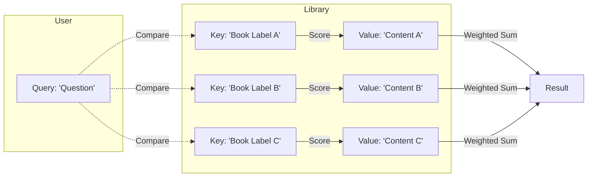
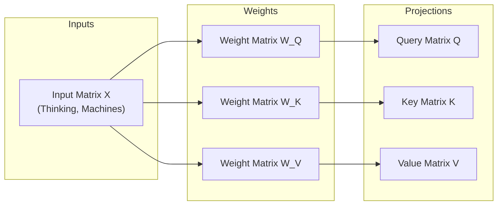
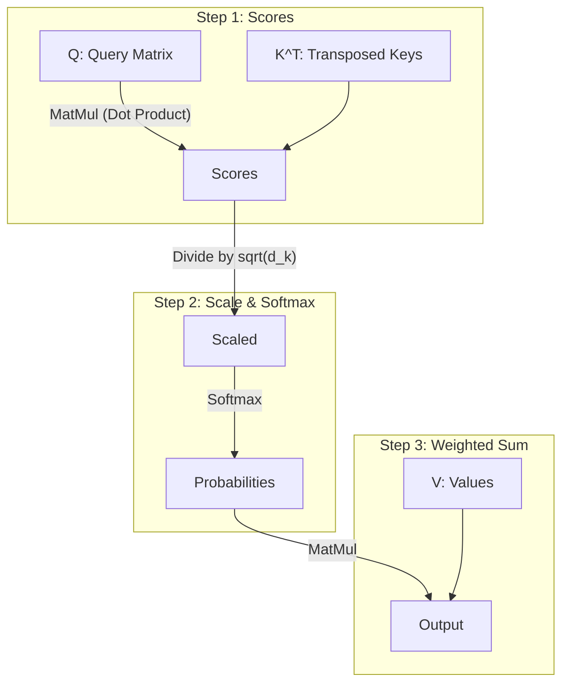
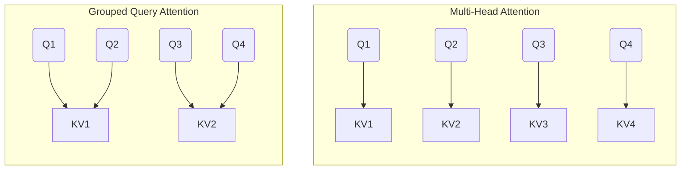
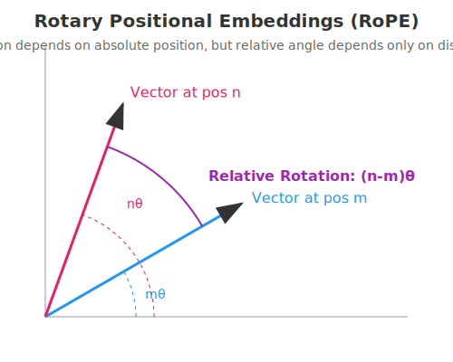
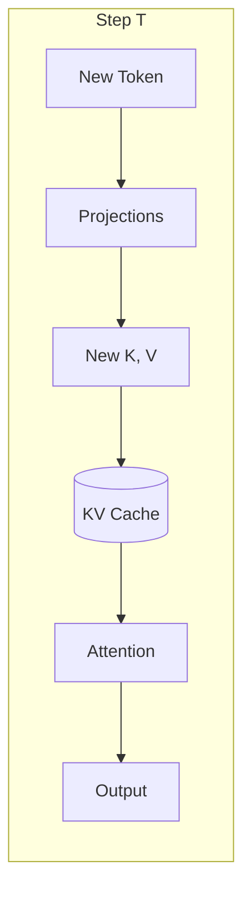

# Chapter 5: The Mechanics of Attention

> "Attention is all you need." — Vaswani et al., 2017

The Transformer architecture has revolutionized Artificial Intelligence, displacing Recurrent Neural Networks (RNNs) as the dominant architecture for sequence modeling. Unlike RNNs, which process data sequentially (and thus struggle with long-range dependencies and parallelization), Transformers process entire sequences in parallel.

At the heart of this revolution is the **Attention Mechanism**.

## The Heart of the Machine: Attention

To understand attention, let's move away from matrices for a moment and use an analogy.

### The Library Analogy

Imagine you are in a massive library. You have a specific question you want to answer.

1.  **Query (`Q`)**: This is your question. *What am I looking for?*
2.  **Key (`K`)**: Every book in the library has a catalog card or a label on its spine. This is the key. *How do I match my question to the content?*
3.  **Value (`V`)**: The content of the book itself. *What information do I actually retrieve?*

The attention mechanism works by comparing your **Query** against every **Key** in the library. The better the match between your Query and a Key, the more "attention" you pay to that book's **Value**.


*Image Credit: [Jay Alammar](https://jalammar.github.io/illustrated-transformer/)*


*Diagram: The Attention Mechanism as a Library. Your Query matches against Keys to retrieve a weighted sum of Values.*

### From Words to Vectors: A Concrete Example

The library analogy is great for intuition, but how do we actually get these vectors from our data?

Let's trace the path of a simple input sequence: **"Thinking Machines"**.

#### Step 1: Embeddings
First, we convert our words into embedding vectors. Let's say our embedding dimension (\\(d_{model}\\)) is 4.
*   **"Thinking"** \\(\rightarrow x_1 = [1.0, 0.0, 1.0, 0.0]\\)
*   **"Machines"** \\(\rightarrow x_2 = [0.0, 1.0, 0.0, 1.0]\\)

We stack these into an input matrix $X$ of shape `[2, 4]`.

#### Step 2: The Weight Matrices
We have three linear layers, each defined by a weight matrix. These are parameters the model learns during training.
*   \\(W_Q\\) (Query Weights)
*   \\(W_K\\) (Key Weights)
*   \\(W_V\\) (Value Weights)

Let's assume we want our Query, Key, and Value vectors to have a dimension (\\(d_k\\)) of 3. Our weight matrices will be shape `[4, 3]`.

#### Step 3: Calculating Q, K, V
To get the vectors for "Thinking", we multiply its embedding $x_1$ by each weight matrix:

\\( q_1 = x_1 \cdot W_Q \\)
\\( k_1 = x_1 \cdot W_K \\)
\\( v_1 = x_1 \cdot W_V \\)

This gives us a query vector $q_1$, a key vector $k_1$, and a value vector $v_1$ for the word "Thinking". We do the exact same for "Machines" ($x_2$).

#### Step 4: Matrix Magic
In practice, we don't loop through words. We use matrix multiplication to do it all at once.

\\( Q = X \cdot W_Q \\)
\\( K = X \cdot W_K \\)
\\( V = X \cdot W_V \\)

If `X` is \\([2, 4]\\) and \\(W_Q\\) is `[4, 3]`, then our resulting `Q` matrix is `[2, 3]`.
*   **Row 1 of Q**: The Query vector for "Thinking".
*   **Row 2 of Q**: The Query vector for "Machines".


*Diagram: Each row in the Input Matrix X corresponds to a word. Multiplying by the weight matrices produces the Q, K, and V matrices, where each row still corresponds to that same word.*

Now that we have our $Q$, $K$, and $V$ matrices, we are ready to calculate attention scores.

### Scaled Dot-Product Attention

Mathematically, we compute this similarity using a dot product. However, as the dimension of the vectors grows, the dot product can become extremely large. To prevent this, we **scale** the result by dividing by the square root of the dimension (\\(\sqrt{d_k}\\)).


*Image Credit: [Jay Alammar](https://jalammar.github.io/illustrated-transformer/)*


*Diagram: The flow of Scaled Dot-Product Attention. Shapes transform from `[Seq, HeadDim]` to `[Seq, Seq]` (Scores) and back to `[Seq, HeadDim]` (Output).*

$$ \text{Attention}(Q, K, V) = \text{softmax}\left(\frac{QK^T}{\sqrt{d_k}}\right)V $$

Let's break this down step-by-step:

1.  **\\(QK^T\\)**: We take the dot product of the Query matrix and the Transposed Key matrix. This gives us a **score matrix** of shape `[SequenceLength, SequenceLength]`. Each entry \\(i, j\\) tells us how much the \\(i\\)-th token cares about the \\(j\\)-th token.
2.  **\\(\frac{1}{\sqrt{d_k}}\\\)**: We divide by the square root of the head dimension. This is the "scaling" part. As dimensions grow, dot products can get very large, pushing the softmax into regions where gradients are tiny (vanishing gradients). Scaling keeps the variance stable (similar to Xavier initialization).
3.  **\\(\text{softmax}(\dots)\\\)**: We apply softmax to convert these raw scores into probabilities. For each query, the attention weights across all keys sum to 1.0.
4.  **\\(\dots V\\)**: Finally, we multiply these probabilities by the Value matrix \\(V\\). This computes a weighted sum of the Values.

If the attention weight for "cat" attending to "meow" is 0.9, the output vector will be 90% composed of the "meow" value vector.

## Multi-Head Attention (MHA)

One attention head is good, but it might focus only on one type of relationship (e.g., syntax). We want the model to understand multiple aspects of language simultaneously (syntax, semantics, tone, etc.).

**Multi-Head Attention** runs several attention mechanisms in parallel. Each "head" has its own unique projection matrices (\\(W_Q, W_K, W_V\\)), allowing it to specialize.

- Head 1 might track subject-verb agreement.
- Head 2 might track pronoun antecedents.
- Head 3 might track emotional sentiment.

> **Note on Diversity**: We don't explicitly tell Head 1 to track verbs and Head 2 to track pronouns. The model *learns* these roles during training. Random initialization helps them start in different places, but there is no guarantee they will all learn unique things. In practice, some heads often end up being redundant or "dead".

After computing attention for all heads, we concatenate their outputs and project them back to the model dimension using an output matrix \\(W_O\\).

### Real-World Example: Pronoun Resolution

To see a concrete example of attention resolving ambiguity, check out the test case `test_attention_pronoun_resolution` in `tests/chapter_05_attention.rs`. It simulates how attention weights shift when resolving the pronoun "it" in the sentences:

*   "The trophy would not fit in the suitcase because **it** was too big." (it \\(\rightarrow\\) trophy)
*   "The trophy would not fit in the suitcase because **it** was too small." (it \\(\rightarrow\\) suitcase)

Running this test prints a heatmap of the attention weights, visualizing exactly where the model "looks" to understand the word "it".

## Modern Optimizations: Grouped Query Attention (GQA)

In the original Transformer (MHA), every Query head had a corresponding Key and Value head.
- 8 Query Heads \\(\rightarrow\\) 8 Key Heads, 8 Value Heads.

This is great for quality but expensive for memory. During inference (specifically decoding), we must cache all the Keys and Values (the **KV Cache**). A large KV cache consumes massive GPU memory bandwidth.

**Multi-Query Attention (MQA)** proposed an extreme solution:
- 8 Query Heads \\(\rightarrow\\) 1 Key Head, 1 Value Head.
This saves memory but can degrade performance.

**Grouped Query Attention (GQA)** is the "Goldilocks" solution used in modern models like **Gemma** and **Llama 3**. We group multiple query heads to share a single KV head.
- 8 Query Heads \\(\rightarrow\\) 2 Key Heads, 2 Value Heads (4 Queries per KV).


*Diagram: Comparison of Multi-Head Attention (Left) vs. Grouped Query Attention (Right). In GQA, multiple query heads share a single KV head.*

This significantly reduces the size of the KV cache while maintaining model performance close to MHA.

## The Problem of Order: Rotary Positional Embeddings (RoPE)

The attention mechanism we described (\\(QK^T\\)) is **permutation invariant**. If you shuffle the words in a sentence, the dot products remain the same (just in different positions). "Sam ate an apple" and "An apple ate Sam" would look identical to the attention layer without extra help.

We need to inject **positional information**.

### Absolute vs. Relative

- **Absolute Positional Embeddings** (Original Transformer): Added a fixed vector to each token based on its index (\\(0, 1, 2 \dots\\)).
- **Relative Positional Embeddings**: Learned the distance between tokens.

**RoPE** (Rotary Positional Embeddings) takes a different approach. Instead of adding a vector, it **rotates** the Query and Key vectors in the complex plane.

### The Rotation Intuition

Imagine the embedding vector as a clock hand.
- Token at position 0: No rotation.
- Token at position 1: Rotate by \\(\theta\\).
- Token at position 2: Rotate by \\(2\theta\\).

The angle between two vectors now depends on their **relative distance** (\\(m - n\\)).
$$ (Rm)^T (Rn) = \cos((m-n)\theta) $$

This allows the model to naturally generalize to sequence lengths longer than it saw during training.

**Why?**
*   **Learned Absolute Embeddings**: If you train a model with max length 1024, it learns specific vectors for positions `0` to `1023`. If you try to feed it token `1024`, the model crashes or fails because it has *no embedding* for that index.
*   **RoPE**: The model learns to rely on the **relative rotation** (`m-n`). Even if the model has never seen position `2000`, it knows that the relationship between position `2000` and `1999` is just a rotation of \\(\theta\\). The physics of the rotation are consistent regardless of the absolute numbers.



## Implementation in `xla-rs`

Let's look at how this comes together in our codebase. Open `src/models/gemma/attention.rs`.

### The `MultiHeadAttention` Struct

```rust,ignore
pub struct MultiHeadAttention<T: TensorElem> {
    pub q_proj: Linear<T>,
    pub k_proj: Linear<T>,
    pub v_proj: Linear<T>,
    pub o_proj: Linear<T>,
    pub num_heads: usize,
    pub num_kv_heads: usize, // For GQA
    pub head_dim: usize,
    pub scaling: T,
}
```

Notice `num_kv_heads`. If `num_kv_heads < num_heads`, we are using GQA.

### The Forward Pass

The `forward` method orchestrates the dance:

1.  **Projection**:
    ```rust,ignore
    let q = self.q_proj.forward(x)?;
    let k = self.k_proj.forward(x)?;
    let v = self.v_proj.forward(x)?;
    ```

2.  **Reshape and Transpose**:
    We reshape the linear output to separate heads.
    `[Batch, SeqLen, Hidden]` \\(\rightarrow\\) `[Batch, SeqLen, Heads, HeadDim]`
    Then we transpose to get heads into the leading dimension for parallel processing:
    `[Batch, Heads, SeqLen, HeadDim]`
    ```rust,ignore
    let q = q.reshape([b, s, self.num_heads, self.head_dim])?;
    let q = q.transpose_axes(1, 2)?; // Swap SeqLen and Heads
    ```

3.  **Apply RoPE**:
    We apply rotation *before* the dot product.
    ```rust,ignore
    let q = apply_rope(&q, freqs_cos, freqs_sin)?;
    let k = apply_rope(&k, freqs_cos, freqs_sin)?;
    ```
    *Note: `apply_rope` in `src/nn/transformer/rope.rs` handles the complex rotation logic.*

4.  **Handle GQA (Repeat KV)**:
    If we have fewer KV heads, we must repeat them to match the number of Query heads so we can perform matrix multiplication.
    ```rust,ignore
    let (k, v) = if self.num_kv_heads != self.num_heads {
        (self.repeat_kv(&k)?, self.repeat_kv(&v)?)
    } else {
        (k, v)
    };
    ```

5.  **Attention Scores**:
    $$ Q @ K^T $$
    ```rust,ignore
    let k_t = k.transpose()?; // [Batch, Heads, HeadDim, SeqLen]
    let mut scores = q.matmul(&k_t)?;
    scores = scores.map(|val| val * self.scaling);
    ```

6.  **Softmax and Output**:
    ```rust,ignore
    self.softmax_inplace(&mut scores)?;
    let output = scores.matmul(&v)?;
    ```

This implementation is efficient, leveraging `xla-rs`'s tensor operations to execute in parallel on the CPU (or GPU/TPU via XLA in the future).

## Optimizing for Inference

The implementation above is **pedantic**: it prioritizes readability and mathematical clarity. However, for high-performance inference (text generation), it has two major bottlenecks:

1.  **Recomputation**: It re-calculates Attention for the *entire sequence* at every step.
2.  **Memory Bandwidth**: It creates many intermediate tensors (deep copies) during reshape and transpose operations.

### The Memory Wall & KV Caching

In autoregressive generation (like ChatGPT), we generate one token at a time.
- Step 1: Input "The" -> Output "cat"
- Step 2: Input "The cat" -> Output "sat"
- Step 3: Input "The cat sat" -> Output "on"

Notice that the Key and Value vectors for "The" and "cat" don't change in Step 3. But our naive implementation recomputes them anyway! This turns an \\(O(N)\\) operation into \\(O(N^2)\\).

**KV Caching** solves this by storing the Keys and Values of past tokens in GPU memory.


*Diagram: With KV Caching, we only compute projections for the **new** token and append them to the cache.*

### Fused Operations

In the pedantic code:
```rust,ignore
let q = q.transpose_axes(1, 2)?; // Allocates NEW memory!
let q = apply_rope(&q, ...)?;    // Allocates NEW memory!
```

Each operation reads from memory and writes to memory. This hits the **Memory Wall**.

An **Optimized Implementation** fuses these steps into a single kernel:
1.  Read input `x`.
2.  Compute `Q, K, V` projections.
3.  Apply RoPE on the fly (in registers).
4.  Write directly to the KV Cache layout.

We have provided an optimized implementation in `src/nn/transformer/attention_optimized.rs` that demonstrates these techniques:

```rust,ignore
// src/nn/transformer/attention_optimized.rs

/// Fused Forward Pass
/// 1. Fused RoPE + Transpose
/// 2. KV Cache Update
/// 3. Fused Attention (Score + Softmax + Weighted Sum)
pub fn forward(
    &self,
    x: &Tensor<T, 3, Cpu>,
    kv_cache: &mut Option<KVCache<T>>,
    ...
) -> Result<Tensor<T, 3, Cpu>> {
    // ...
    // 2. Fused Reshape + Transpose + RoPE
    let q_rope = self.fused_rope_transpose(&q, ...)?;
    
    // 3. KV Cache Management
    if let Some(cache) = kv_cache {
        cache.update(&k_rope, &v_transposed, start_pos)?;
    }
    
    // 4. Fused Attention Kernel
    // Computes Softmax(Q @ K.T) @ V without materializing the full score matrix
    let output = self.fused_attention(&q_rope, ...)?;
    
    // ...
}
```

This approach is significantly faster for generation but more complex to write and debug. By having both, we get the best of both worlds: clarity for learning and performance for running.
