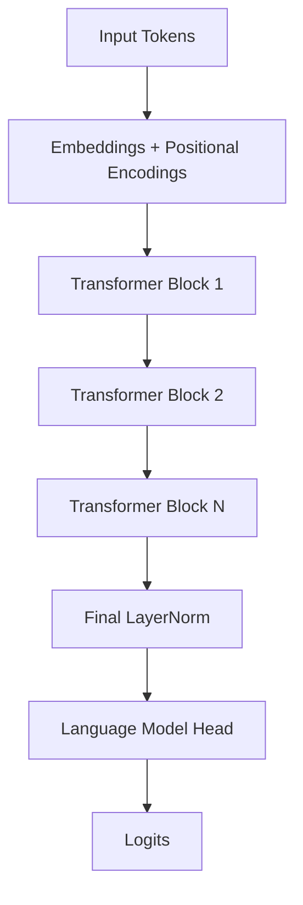

# Building GPT-2 from Scratch

In this chapter, we will build a complete GPT-2 model from scratch using `xla-rs`. We will go beyond simple tensor operations and implement a real-world, production-grade Large Language Model (LLM).

We will cover:
1.  **Tokenizer**: Converting text to numbers.
2.  **Embeddings**: Representing tokens and positions.
3.  **Attention**: The core mechanism of the Transformer.
4.  **The Model**: Stacking blocks to create GPT-2.
5.  **Training**: Using our new `AdamW` optimizer and `DataLoader` to train on Shakespeare.

## 1. The Architecture

GPT-2 is a **Decoder-only Transformer**. It processes a sequence of tokens and predicts the next token in the sequence.



## 2. Tokenizer

Before we can process text, we need to convert it into numbers (token IDs). We'll use the `tokenizers` crate, which is the standard in the Rust ecosystem (and used by Hugging Face).

```rust,ignore
use tokenizers::Tokenizer;

fn main() {
    // Load a pre-trained tokenizer (e.g., GPT-2)
    let tokenizer = Tokenizer::from_file("gpt2-tokenizer.json").unwrap();

    let encoding = tokenizer.encode("Hello, world!", false).unwrap();
    println!("IDs: {:?}", encoding.get_ids());
}
```

## 3. Embeddings

GPT-2 uses two types of embeddings:
1.  **Token Embeddings (`wte`)**: Maps each token ID to a vector of size `hidden_size`.
2.  **Positional Embeddings (`wpe`)**: Maps each position (0, 1, 2...) to a vector. Unlike modern models (like Gemma/Llama) that use Rotary Embeddings (RoPE), GPT-2 uses **learned absolute positional embeddings**.

```rust,ignore
pub struct GPT2Model<T: TensorElem> {
    pub wte: Embedding<T>, // Token embeddings
    pub wpe: Embedding<T>, // Positional embeddings
    // ...
}
```

## 4. Layer Normalization

GPT-2 uses **Layer Normalization** (LayerNorm), unlike Gemma which uses RMSNorm. LayerNorm centers and scales the input features.

$$ \text{LayerNorm}(x) = \frac{x - \mu}{\sigma} \cdot \gamma + \beta $$

where $\gamma$ (weight) and $\beta$ (bias) are learned parameters.

## 5. Causal Self-Attention

This is the heart of the model. "Causal" means the model can only attend to *past* tokens, not future ones. We achieve this using a mask.

GPT-2 splits the attention mechanism into:
-   **c_attn**: A single linear layer that projects input $x$ to Query, Key, and Value ($Q, K, V$).
-   **c_proj**: A linear layer that projects the attention output back to `hidden_size`.

```rust,ignore
// Simplified Attention Logic
let (q, k, v) = c_attn.forward(x).split(3, dim);
let scores = (q @ k.transpose()) / sqrt(head_dim);
let masked_scores = scores.mask_fill(mask == 0, -inf);
let probs = softmax(masked_scores);
let output = probs @ v;
let result = c_proj.forward(output);
```

## 6. The MLP (Feed-Forward Network)

The MLP in GPT-2 is a simple two-layer network with a GELU activation function.
It expands the dimension from `hidden_size` to `4 * hidden_size` and back.

```rust,ignore
pub struct GPT2MLP<T: TensorElem> {
    pub c_fc: Linear<T>,   // Expansion
    pub c_proj: Linear<T>, // Projection
}

impl<T: TensorElem> GPT2MLP<T> {
    pub fn forward(&self, x: &Tensor<T, 3>) -> Result<Tensor<T, 3>> {
        let x = self.c_fc.forward(x)?;
        let x = x.gelu()?; // Gaussian Error Linear Unit
        self.c_proj.forward(&x)
    }
}
```

## 7. The Transformer Block

GPT-2 uses a **Pre-Norm** architecture (mostly), but with a slight twist compared to the original Transformer paper.

```rust,ignore
pub struct GPT2Block<T: TensorElem> {
    pub ln_1: LayerNorm<T>,
    pub attn: CausalSelfAttention<T>,
    pub ln_2: LayerNorm<T>,
    pub mlp: GPT2MLP<T>,
}

impl<T: TensorElem> GPT2Block<T> {
    pub fn forward(&self, x: &Tensor<T, 3>) -> Result<Tensor<T, 3>> {
        // Residual Connection 1
        let residual = x;
        let x = self.ln_1.forward(x)?;
        let x = self.attn.forward(&x)?;
        let x = residual + x;

        // Residual Connection 2
        let residual = &x;
        let x = self.ln_2.forward(&x)?;
        let x = self.mlp.forward(&x)?;
        let x = residual + x;
        
        Ok(x)
    }
}
```

## 8. Training Loop

Now we can put it all together. We'll use our `AdamW` optimizer and `DataLoader`.

```rust,ignore
// 1. Setup
let config = GPT2Config::gpt2_small();
let mut model = GPT2ForCausalLM::new(config);
let mut optimizer = AdamW::new(1e-4);

// 2. Data
let dataset = TextDataset::new("shakespeare.txt");
let loader = DataLoader::new(dataset, 32).shuffle(true);

// 3. Loop
for (step, batch) in loader.iter().enumerate() {
    // Forward
    let logits = model.forward(&batch)?;
    let loss = cross_entropy(&logits, &batch)?;

    // Backward
    loss.backward();

    // Update
    optimizer.step();
    optimizer.zero_grad();

    println!("Step {}: Loss = {}", step, loss.item());
}
```

By following these steps, you have built a fully functional LLM capable of generating text!
