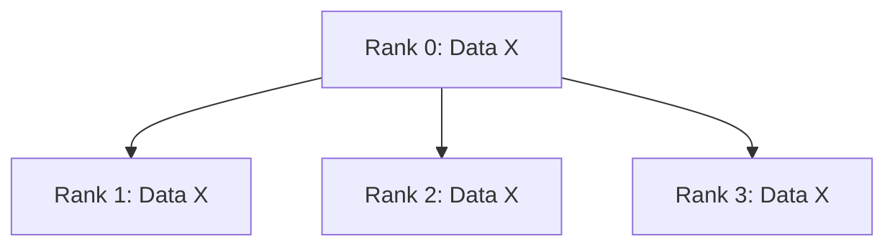
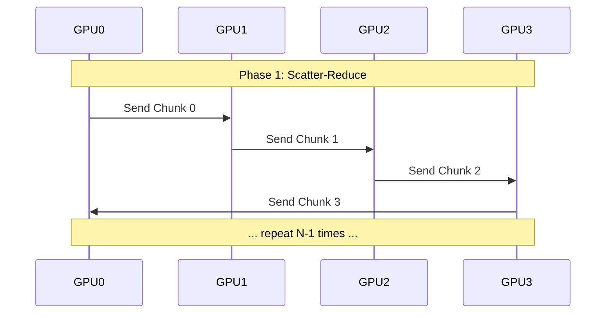

# Chapter 8: Communication Collectives

> \[!NOTE]
> This chapter is under construction.

## The Physics of Data Movement

Imagine you are trying to train a neural network that is so large, its brain spans across **32 different GPUs spread over 4 separate machines**. To learn, these islands must talk to each other. They must share what they've learned (gradients) and agree on the next step.

If this communication is slow, it doesn't matter how fast the islands can think (compute). The entire system waits.

In distributed computing, **communication is the bottleneck**. The speed of light is finite, and bandwidth is expensive. To master large-scale AI, you must stop thinking about "sending data" and start thinking about the *physics* of that movement.

### Latency vs. Bandwidth

There is a classic analogy:
> Never underestimate the bandwidth of a station wagon full of hard drives hurtling down the highway.

-   **Bandwidth** is the width of the pipe. It's how many gigabytes per second you can push.
-   **Latency** is the time it takes for the first byte to arrive. It's the overhead of packing the station wagon and starting the engine.

In a multi-node setup, this distinction is critical:
-   **Intra-Node (NVLink)**: Inside one machine (8 GPUs), bandwidth is massive (900 GB/s). Latency is tiny.
-   **Inter-Node (InfiniBand/Ethernet)**: Between the 4 machines, bandwidth is lower (50-400 GB/s). Latency is higher.

This dictates our strategy:
-   **Tensor Parallelism** is chatty. It sends many small messages. We keep it **inside the node** (e.g., across the 8 GPUs of Machine A).
-   **Data Parallelism** sends huge messages (gradients). It can tolerate the slower bridges **between nodes**.

## The Vocabulary of Scale

We don't just write `send(data, destination)`. That's too low-level. It's like programming in assembly. Instead, we use **Collectives**—high-level primitives that describe *patterns* of communication.

These primitives are implemented by libraries like **NCCL** (NVIDIA Collective Communications Library) or **RCCL** (AMD). In XLA, they are first-class citizens.

### 1. Broadcast: The Town Crier

**"I have the truth. Now you all have it."**

-   **What it does**: One rank (the root, usually Rank 0) sends a tensor to all other ranks.
-   **Use Case**: Initialization. Rank 0 loads the weights from disk and broadcasts them so every GPU starts with the exact same brain.



### 2. All-Reduce: The Democratic Sum

**"We all have a piece. We all need the total."**

This is the workhorse of Deep Learning. In Data Parallelism, every GPU computes a gradient on its own mini-batch. To update the model, we need the *average* gradient across all GPUs.

-   **Input**: Every rank has a tensor $T_i$.
-   **Output**: Every rank gets $\sum T_i$ (or mean/max).

#### The Ring Algorithm
How do we do this efficiently? We don't just have everyone send to everyone (that's $O(N^2)$). We form a **Ring**.

1.  **Scatter-Reduce**: We chop the tensor into $N$ chunks. Each rank sends a chunk to its neighbor, adding it to what it receives. After $N-1$ steps, each rank holds a *fully summed* chunk of the total tensor.
2.  **All-Gather**: Each rank sends its fully summed chunk to its neighbor. After $N-1$ steps, everyone has all the chunks.

This algorithm is bandwidth-optimal. The amount of data sent per device is constant, regardless of the number of GPUs!



### 3. All-Gather: The Assembly

**"I have a shard. You have a shard. Let's combine them."**

-   **Input**: Rank $i$ has tensor $T_i$.
-   **Output**: Every rank gets the concatenated tensor $\[T_0, T_1, ..., T_N\]$.
-   **Use Case**: Tensor Parallelism. After computing a part of the output (e.g., specific heads in Attention), we might need to gather the full output for the next layer.

### 4. Reduce-Scatter: The Divide

**"We have the full picture, but we only want to keep our piece."**

-   **Input**: Every rank has a full tensor (or a sum of full tensors).
-   **Output**: Rank $i$ ends up with just the $i$-th chunk of the reduced tensor.
-   **Use Case**: The backward pass of Row Parallelism. It's the inverse of All-Gather.

## Implementation in XLA

In `xla-rs`, we don't manually manage sockets. We use the `XlaBuilder` to insert collective operations into the computation graph.

### The Replica ID
The magic number. Inside your XLA program, everything looks identical *except* for `xla::replica_id()`. This is how a device knows "I am GPU 3".

```rust,ignore
use xla::{XlaBuilder, Result};

fn main() -> Result<()> {
    let client = xla::PjRtClient::gpu(0.95, false)?;
    let builder = XlaBuilder::new("distributed_sum");

    // 1. Create a value unique to this replica (e.g., its ID)
    let replica_id = builder.replica_id();
    let data = replica_id.convert_element_type(xla::ElementType::F32);

    // 2. Perform All-Reduce (Sum)
    // We sum the 'data' across all replicas.
    // The result on every device will be: 0 + 1 + 2 + ... + (N-1)
    let sum = builder.all_reduce(
        &data,
        &xla::XlaComputation::add(&builder, xla::ElementType::F32, &[], &builder.constant_r0(0f32))?, // The reduction function
        &[], // Replica groups (empty means all replicas)
        None, // Channel ID (optional)
        None, // Shape (optional)
    )?;

    // 3. Compile and Run
    // When we run this, XLA handles the NCCL calls under the hood.
    let computation = builder.build(&sum)?;
    let executables = client.compile(&computation)?;
    
    // ... execution logic (spawning processes or threads) ...
    
    Ok(())
}
```

### Cross-Replica Sum (CRS)
In XLA, `all_reduce` is often called `cross_replica_sum` (CRS) when the reduction operation is addition. It is the most common collective you will see.

## Optimization: Overlap

The holy grail of distributed training is **Communication-Computation Overlap**.

While the data is flying across the NVLink wires (Communication), the GPU cores should not be idle. They should be crunching numbers (Computation) for the next layer or a different part of the model.

-   **Bucketization**: Small tensors are bad. The latency kills you. We group many small gradients into one large "bucket" before doing an All-Reduce.
-   **Pipelining**: Start sending the gradients of Layer $L$ while computing the gradients of Layer $L-1$.

In the next chapters, we will see how **Tensor Parallelism** and **Data Parallelism** use these collectives to shatter the limits of a single device.
